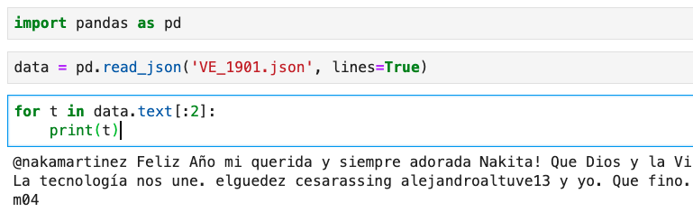

# Teoría de la Información: Descriptores de los datos
***
Autor: Edgar Rios Linares  
<erlinares@gmail.com>  
Fecha: 8-Sep-2020  
Versión: 1.2
***
## Actividad 1
Encontrar las asociaciones de palabras más significativas usando la medida de información mutua para cada conjunto de datos.

Entregar el documento PDF con los código generados para la resolución de la tarea. Incluir las asociaciones más importantes  respecto a medida de información mutua. Es decir, se debe de calcular todas las asociaciones entre el  vocabulario único, esto hacerlo de forma independiente para cada conjunto de datos (México, España, Venezuela).  Mostrar las 100 asociaciones más importantes para cada país de acuerdo a los conjuntos de datos proporcionados, indicar su índice de información mutua. Comparar las asociaciones entre los tres países.

+ 1. Revisar el artículo [Word Association Norms, Mutual Information, and Lexicography, Church, Kenneth Ward and Hanks, Patrick](https://www.aclweb.org/anthology/J90-1003/). En este artículo se describen las estrategias usadas y detalles de la tarea.

+ 2. Realizar el descubrimiento de asociaciones de palabras para cada conjunto de datos de forma independiente. Los datos son tweets de México, Venezuela y España. 

    + Dado que son textos cortos, usar una ventana de 2 palabras, para calcular las probabilidades conjuntas p(x,y)
    + Usar frecuencia mínima, frecuencias <=  5, no se consideran
    + Preprocesar los datos: usar minúsculas, eliminar acentos.
    + Dado que los datos son de textos informales, hay una alta probabilidad de errores de ortografía y redundancia en los caracteres , es decir, palabras como bueeeeeno y bueno. Reducir las palabras bueeeeeeno => bueeno, es decir, todos los caracteres que se repiten dejarlos de longitud 2. Esto con el fin de reducir el vocabulario. 

Descripción de los datos:

1. los archivos están comprimidos con gzip y están en formato json. 
+ <http://ingeotec.mx/~sabino/MCDI-PI/MX_1901.json.gz> (2,147,441 tweets)
+ <http://ingeotec.mx/~sabino/MCDI-PI/ES_1901.json.gz> (1,945,012 tweets)
+ <http://ingeotec.mx/~sabino/MCDI-PI/VE_1901.json.gz> (433,780 tweets)

Cada línea del archivo contiene un tweet codificado en formato json, text plano, codificado en UTF-8, contiene dos campos ***text***
y ***created_at*** (fecha de creación del tweet), por ejemplo:

  **"text":"@Horacitu Mucha salud para todos!!!","created_at":"TueJan0105:59:55+00002019"**
    
Sugerencia: 

Pueden leer los archivos en formato json usando el paquete json de Python para transformar los datos a estructuras de diccionarios y manipularlos (https://docs.python.org/3/library/json.html). También pueden usar el paquete pandas para la lectura (https://pandas.pydata.org/pandas-docs/stable/reference/api/pandas.read_json.html).

Un ejemplo para el acceso al texto es el siguiente muestra los primeros 2 tweets.

